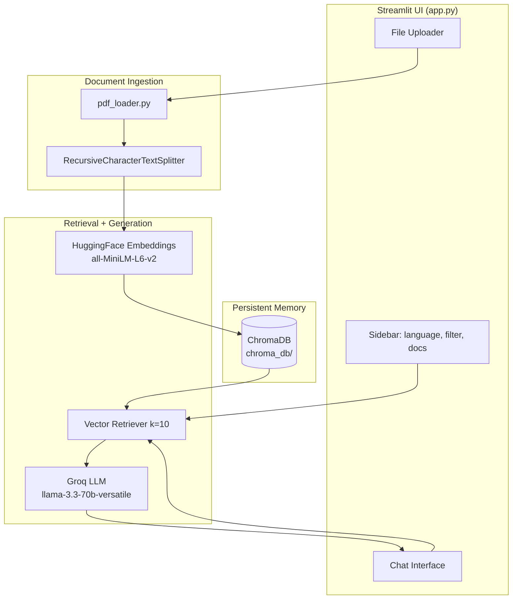
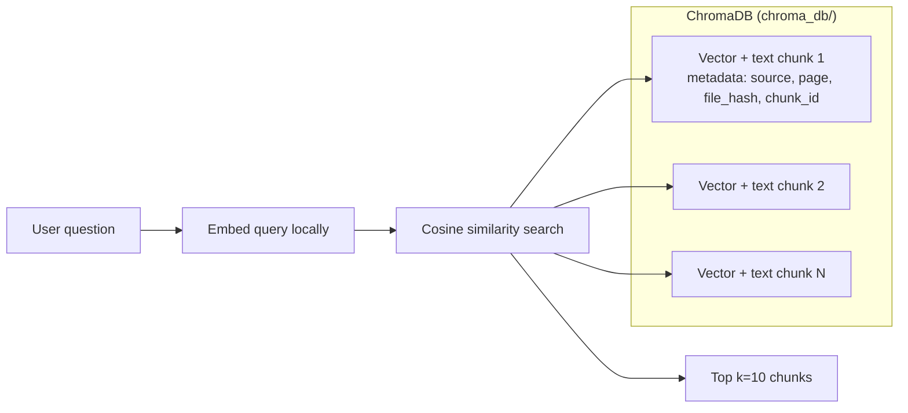
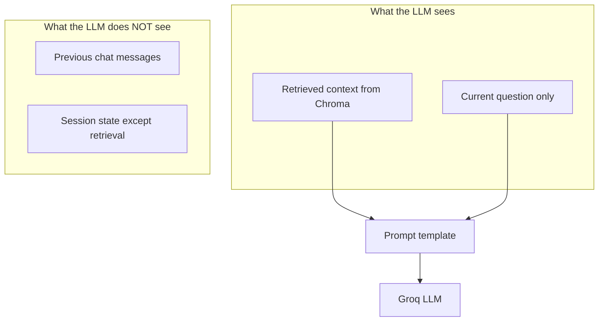
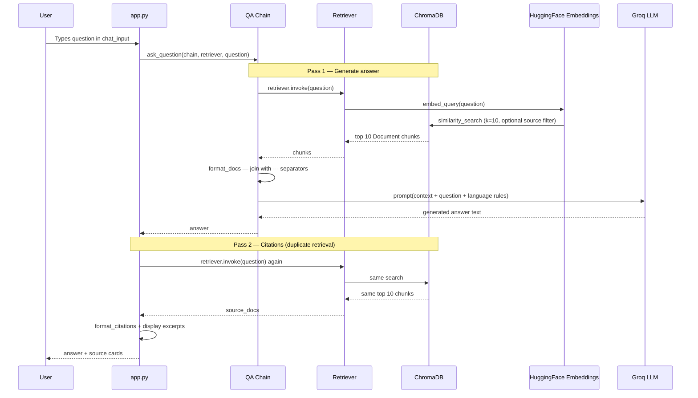
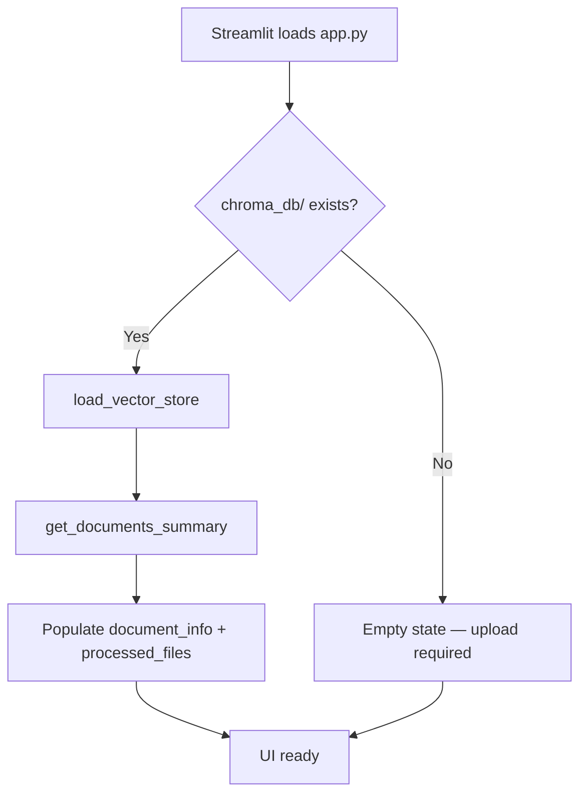
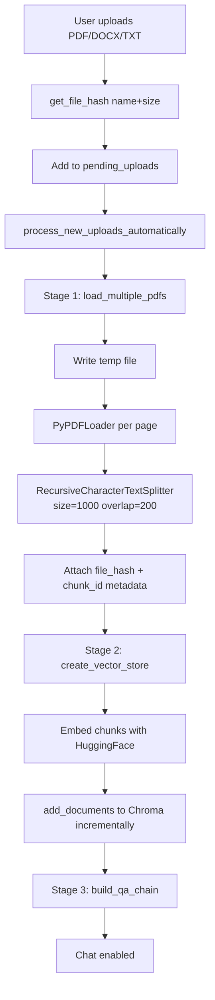
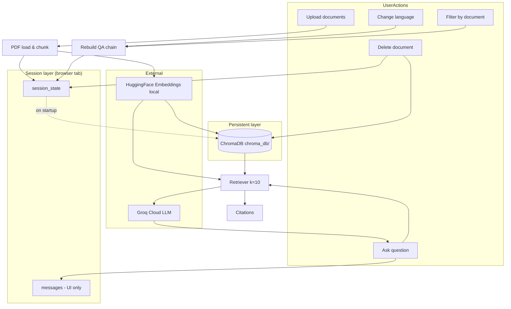

# Nepal Docs Q&A App — Technical Documentation

A **Retrieval-Augmented Generation (RAG)** web application for asking questions about uploaded Nepali government documents (citizenship, tax, company registration, etc.). Built with **Streamlit**, **LangChain**, **ChromaDB**, **HuggingFace embeddings**, and **Groq LLM**.

---

## Table of Contents

1. [High-Level Architecture](#1-high-level-architecture)
2. [Memory & Storage Model](#2-memory--storage-model)
3. [How a Question Gets Answered](#3-how-a-question-gets-answered)
4. [End-to-End Workflows](#4-end-to-end-workflows)
5. [Module Reference](#5-module-reference)
6. [Session State](#6-session-state)
7. [Configuration & Dependencies](#7-configuration--dependencies)
8. [Data Structures & Metadata](#8-data-structures--metadata)
9. [Known Limitations](#9-known-limitations)

---

## 1. High-Level Architecture



### Project layout

```
NepalDocs Q&A App/
├── app.py                 # Streamlit UI, orchestration, session state
├── chroma_db/             # Persistent vector database (created at runtime)
├── temp/                  # Temporary PDF files during loading
├── .env                   # GROQ_API_KEY (required for chat)
└── src/
    ├── pdf_loader.py      # PDF load + text chunking
    ├── embeddings.py      # Chroma vector store CRUD
    ├── retriever.py       # RAG chain (retrieve → prompt → LLM)
    └── citations.py       # Source citation formatting
```

---

## 2. Memory & Storage Model

This app uses **three distinct memory layers**. They serve different purposes and must not be confused.

### 2.1 Persistent vector memory — ChromaDB

| Property | Value |
|----------|-------|
| **Location** | `chroma_db/` directory on disk |
| **Collection name** | `nepaldocs` |
| **What is stored** | Text chunk content + embedding vectors + metadata |
| **Embedding model** | `sentence-transformers/all-MiniLM-L6-v2` (384-dim, local) |
| **Survives** | App restarts, browser refresh |
| **Purpose** | Semantic search — find document chunks similar to a user question |

Each indexed chunk stores metadata:

- `source` — original filename (e.g. `citizenship.pdf`)
- `page` — page number (0-indexed, from PyPDFLoader)
- `file_hash` — deduplication key `{filename}_{size}`
- `chunk_id` — stable ID `{file_hash}_{index}`



**Incremental indexing:** New uploads are appended to the existing collection. Duplicate `chunk_id` values are skipped. Documents can be deleted by `file_hash` without rebuilding the entire store.

### 2.2 Session memory — Streamlit `st.session_state`

| Key | Type | Purpose | Persists across refresh? |
|-----|------|---------|--------------------------|
| `chunks` | `List[Document]` | In-memory copy of all loaded text chunks | No (lost on refresh unless reloaded from Chroma summary) |
| `processed_files` | `Set[str]` | File hashes already indexed | Partially (rebuilt from Chroma on startup) |
| `document_info` | `List[dict]` | UI document list (name, size, status, chunk_count) | Partially (synced from Chroma on startup) |
| `pending_uploads` | `List[dict]` | Files waiting for automatic processing | No |
| `vector_store` | Chroma object | Live connection to ChromaDB | Re-loaded on startup if `chroma_db/` exists |
| `qa_chain` | LangChain Runnable | Retrieve → prompt → LLM pipeline | Rebuilt when settings change |
| `retriever` | LangChain Retriever | Same retriever used for citations | Rebuilt when settings change |
| `messages` | `List[dict]` | Chat history for UI display | No |
| `language` | `str` | Answer language preference | No |
| `selected_source` | `str` | Document filter for retrieval | No |
| `current_settings` | `tuple` | Cache key to detect chain rebuild need | No |

**Important:** Session state holds **UI and pipeline objects**, not long-term knowledge. The authoritative document index is ChromaDB.

### 2.3 Conversational memory — **None (by design)**

The LLM does **not** receive prior chat messages. Each question is answered independently using:

1. The current user question
2. Retrieved document chunks only

Chat history (`st.session_state.messages`) is **display-only**. Follow-up questions like *"What about the fee?"* will **not** inherit context from earlier answers unless that information appears in retrieved chunks.



### 2.4 External / ephemeral memory

| Component | Role |
|-----------|------|
| **Groq API** | Stateless LLM inference; no server-side conversation memory |
| **HuggingFace embedding model** | Loaded into process RAM when vector store is used |
| **`temp/` folder** | Short-lived PDF copies during upload parsing (deleted after load) |

---

## 3. How a Question Gets Answered

This is the core RAG loop implemented in `src/retriever.py` and invoked from `app.py`.

### Step-by-step



### Retrieval parameters

| Parameter | Default | Effect |
|-----------|---------|--------|
| `k` | `10` | Number of chunks injected into the prompt |
| `source_filter` | Sidebar selection | If not `"All documents"`, Chroma metadata filter `{"source": filename}` |
| `language` | `"auto"` | Instruction embedded in prompt (see [Known Limitations](#9-known-limitations)) |

### Prompt structure

The LLM receives:

1. **System-style instructions** — Nepali government doc assistant; answer only from context; fallback message in EN/NE
2. **Language instruction** — auto-detect, force English, or force Nepali
3. **Context** — up to 10 retrieved chunks, separated by `\n\n---\n\n`
4. **Question** — raw user input

The model is **`llama-3.3-70b-versatile`** via Groq at **`temperature=0`** (deterministic, factual bias).

### Why retrieval runs twice

`ask_question()` calls:

1. `chain.invoke(question)` — retriever runs inside the LCEL chain for answer generation
2. `retriever.invoke(question)` — explicit second call to obtain `source_docs` for citations

Both use the same retriever configuration, so results should match.

---

## 4. End-to-End Workflows

### 4.1 Application startup



On startup, if a previous session indexed documents, the app **reloads Chroma** and reconstructs the document list from stored metadata. In-memory `chunks` may be empty until new uploads; chunk counts come from Chroma summary.

### 4.2 Document upload → ready for chat



**Pipeline stepper UI:** Upload → Process → Embed → Chat (steps 1–4).

Automatic processing triggers when `pending_uploads` contains files whose hash is not in `processed_files`. No manual "Process" button is required.

### 4.3 Settings change (language or document filter)

When `selected_source` or `language` changes:

1. `current_settings` is invalidated
2. `build_qa_chain()` runs again with new `search_kwargs.filter` and language instruction
3. Chat input remains enabled if `vector_store` exists

### 4.4 Document deletion


Deletion is **incremental** — only chunks matching `file_hash` are removed from Chroma.

### 4.5 Clear chat history

Clears `st.session_state.messages` only. Does **not** affect Chroma, chunks, or the QA chain.

---

## 5. Module Reference

### 5.1 `app.py` — Orchestration & UI

**Responsibilities:**

- Streamlit page layout (sidebar + main area)
- Session state initialization and lifecycle
- File upload handling and deduplication
- Automatic processing pipeline invocation
- QA chain rebuild on setting changes
- Chat UI with citations display

**Key functions:**

| Function | Role |
|----------|------|
| `process_new_uploads_automatically()` | Full ingest pipeline for new pending files |
| `remove_document(doc_hash)` | Session cleanup + Chroma delete + store reload |
| `build_stepper(current_step)` | Visual 4-step progress indicator |
| `ensure_doc_info()` / `refresh_doc_counts()` | Keep document list in sync |

### 5.2 `src/pdf_loader.py` — Ingestion

**Responsibilities:**

- Save uploaded file to `temp/{filename}`
- Load PDF pages via `PyPDFLoader`
- Split into chunks with `RecursiveCharacterTextSplitter`
- Tag each chunk with `source` = filename

| Parameter | Default | Meaning |
|-----------|---------|---------|
| `chunk_size` | 1000 | Max characters per chunk |
| `chunk_overlap` | 200 | Overlap between consecutive chunks (preserves context at boundaries) |

**`get_file_hash()`** — `{name}_{size}` string; used to skip re-processing identical uploads.

> **Note:** Despite the UI accepting `.docx` and `.txt`, the loader currently uses `PyPDFLoader` only. Non-PDF uploads may fail at processing time.

### 5.3 `src/embeddings.py` — Vector store

**Responsibilities:**

- Embedding model selection (HuggingFace default, OpenAI optional)
- Chroma load/create/add/delete operations
- Document inventory from persisted metadata

| Function | Purpose |
|----------|---------|
| `get_embeddings_model(provider)` | Returns HuggingFace or OpenAI embeddings |
| `load_vector_store()` | Open existing Chroma collection |
| `create_vector_store(chunks)` | Incrementally add chunks, skip duplicates |
| `delete_document_by_hash()` | Remove all vectors for one file |
| `get_documents_summary()` | List indexed docs with chunk counts |
| `list_indexed_file_hashes()` | Set of hashes already in DB |
| `search_similar()` | Direct similarity search (utility, not used by main chat flow) |

### 5.4 `src/retriever.py` — RAG chain

**Responsibilities:**

- Build LangChain LCEL pipeline
- Configure retriever with `k` and optional metadata filter
- Invoke Groq LLM with grounded prompt

**LCEL chain composition:**

```
question ──┬──> retriever ──> format_docs ──> context ──┐
           │                                              ├──> prompt ──> LLM ──> StrOutputParser
           └──────────────────────────────────> question ┘
```

### 5.5 `src/citations.py` — Source attribution

**Responsibilities:**

- Deduplicate `(source, page)` pairs from retrieved chunks
- Format for UI captions and optional text export

Does not influence the LLM answer — purely post-processing for transparency.

---

## 6. Session State

Complete reference of runtime state in `app.py`:

```python
st.session_state.chunks              # All Document chunks in memory
st.session_state.processed_files     # Set of file_hash strings
st.session_state.messages            # Chat UI history [{role, content, citations?}]
st.session_state.language            # "auto" | "english" | "nepali"
st.session_state.selected_source     # "All documents" | specific filename
st.session_state.document_info       # [{name, size, hash, status, chunk_count}]
st.session_state.pending_uploads     # [{name, size, hash, data}]
st.session_state.error               # Last error string or None
st.session_state.processing          # Boolean lock during ingest
st.session_state.vector_store        # Chroma instance or None
st.session_state.qa_chain            # LangChain Runnable or None
st.session_state.retriever           # LangChain Retriever or None
st.session_state.current_settings    # (selected_source, language) tuple cache
```

Document status values: `New` → `Queued` → `Processing` → `Ready`

---

## 7. Configuration & Dependencies

### Environment variables

| Variable | Required | Purpose |
|----------|----------|---------|
| `GROQ_API_KEY` | Yes (for chat) | Authenticates Groq LLM API calls |

Loaded via `python-dotenv` in `retriever.py`.

### Core libraries (from imports)

- `streamlit` — web UI
- `langchain-core`, `langchain-community`, `langchain-groq`, `langchain-huggingface`, `langchain-openai`, `langchain-text-splitters`
- `chromadb` (via LangChain Chroma wrapper)
- `sentence-transformers` (pulled in by HuggingFace embeddings)
- `pydantic` — API key typing

### Run the app

```bash
streamlit run app.py
```

---

## 8. Data Structures & Metadata

### Chunk metadata (after full pipeline)

```json
{
  "source": "citizenship.pdf",
  "page": 2,
  "file_hash": "citizenship.pdf_1048576",
  "chunk_id": "citizenship.pdf_1048576_0"
}
```

### Citation object

```json
{
  "source": "citizenship.pdf",
  "page": 3
}
```

### Document info object (UI)

```json
{
  "name": "citizenship.pdf",
  "size": 1048576,
  "hash": "citizenship.pdf_1048576",
  "status": "Ready",
  "chunk_count": 42
}
```

---

## 9. Known Limitations

| Area | Behavior |
|------|----------|
| **No conversational memory** | Prior chat turns are not sent to the LLM |
| **Language setting mismatch** | UI stores `"english"` / `"nepali"` but `build_qa_chain()` checks `"English"` / `"Nepali"` — language buttons may not force output language as intended; auto-detect path is always used |
| **File type support** | Uploader accepts PDF, DOCX, TXT; loader only implements PDF via `PyPDFLoader` |
| **Duplicate retrieval** | Same query retrieved twice per answer (chain + citations) — correct but adds latency |
| **File hash** | Based on name + size only, not content — renamed or same-size different files may collide or skip incorrectly |
| **Chunk params fixed** | 1000/200 split settings are not exposed in UI |
| **No auth** | Single-user local app; no multi-tenant isolation |

---

## Quick Reference Diagram — Full System



---

*Generated from codebase analysis of Nepal Docs Q&A App.*
